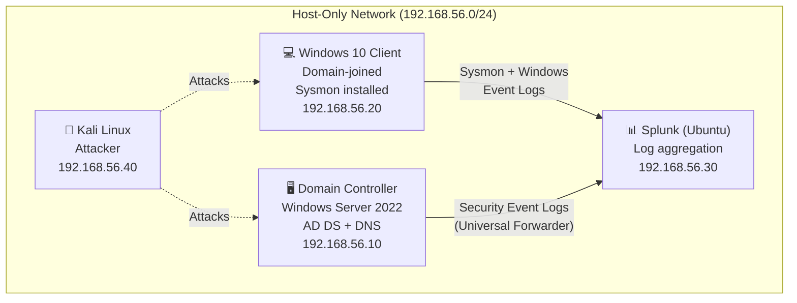

# 🏯 Active Directory Attack & Detection Lab

A self-built Active Directory environment used to execute common AD attacks and build the detections that catch them. Demonstrates the full defender loop: **understand the attack → run it in a controlled lab → detect it in logs → write the detection rule.**

> ⚙️ **Lab built and operated by me in an isolated, host-only virtual network. All attacks performed against my own systems for defensive research.**

---

## 🗺️ Architecture



| Host | Role | OS | IP |
|------|------|----|----|
| **DC01** | Domain Controller (AD DS, DNS) | Windows Server 2022 | 192.168.56.10 |
| **WIN10** | Domain-joined workstation + Sysmon | Windows 10 | 192.168.56.20 |
| **SPLUNK** | Log aggregation + detection | Ubuntu 22.04 | 192.168.56.30 |
| **KALI** | Attacker | Kali Linux | 192.168.56.40 |

**Domain:** `corp.lab` · **Hypervisor:** VirtualBox · **Network:** Host-only (isolated, no internet for victim hosts)

<!-- SCREENSHOT: VirtualBox dashboard showing all 4 VMs running → screenshots/01-vms-running.png -->

---

## 🎯 What This Lab Demonstrates

- Standing up a Windows domain from scratch (AD DS, DNS, OU structure, GPOs)
- Centralized logging with Sysmon (SwiftOnSecurity config) + Splunk
- Executing real AD attacks against my own infrastructure
- Building Splunk detections and Sigma rules that catch each attack
- Mapping every attack and detection to **MITRE ATT&CK**

---

## 🔧 Build Summary

### 1. Domain Controller
- Installed Windows Server 2022, promoted to DC with `Install-ADDSForest` for `corp.lab`
- Created OUs (`Workstations`, `Servers`, `Users`), test users, and service accounts
- Configured DNS and verified domain resolution

<!-- SCREENSHOT: Server Manager showing AD DS role + corp.lab domain → screenshots/02-dc-promoted.png -->

### 2. Windows 10 Client
- Joined to `corp.lab` domain
- Deployed **Sysmon** with SwiftOnSecurity configuration for rich process/network logging
- Verified Event Log generation

<!-- SCREENSHOT: Win10 joined to domain (System properties) → screenshots/03-client-joined.png -->

### 3. Splunk
- Installed Splunk Free on Ubuntu
- Configured Universal Forwarders on DC + client to ship Security + Sysmon logs
- Built indexes and verified ingestion with `index=* | stats count by host`

<!-- SCREENSHOT: Splunk search showing events from both hosts → screenshots/04-splunk-ingest.png -->

---

## ⚔️ Attack Scenarios & Detections

Each scenario follows the same structure: **attack → what it looks like in logs → the detection.**

### Scenario 1 — RDP / SMB Brute Force
**ATT&CK:** T1110 (Brute Force)

**Attack (from Kali):**
```bash
hydra -l administrator -P rockyou.txt rdp://192.168.56.20
```

**Detection logic (Splunk):**
```spl
index=windows EventCode=4625
| stats count by src_ip, Account_Name
| where count > 10
| sort - count
```
Windows Event ID **4625** = failed logon. A spike from one source = brute force.

<!-- SCREENSHOT: Splunk dashboard showing 4625 spike → screenshots/05-bruteforce-detection.png -->

### Scenario 2 — Kerberoasting
**ATT&CK:** T1558.003 (Kerberoasting)

**Attack:** Request service tickets for SPN-enabled accounts, extract for offline cracking.
```bash
# From Kali, using Impacket
GetUserSPNs.py corp.lab/lowprivuser:Password123 -dc-ip 192.168.56.10 -request
```

**Detection logic (Splunk):**
```spl
index=windows EventCode=4769 Ticket_Encryption_Type=0x17
| stats count by Account_Name, Service_Name, Client_Address
| where count > 5
```
Event ID **4769** with RC4 encryption (0x17) requested for many SPNs = Kerberoasting signature.

<!-- SCREENSHOT: Splunk showing 4769 RC4 ticket requests → screenshots/06-kerberoast-detection.png -->

### Scenario 3 — AS-REP Roasting
**ATT&CK:** T1558.004 (AS-REP Roasting)

**Attack:** Target accounts with "Do not require Kerberos preauth" enabled.
```bash
GetNPUsers.py corp.lab/ -dc-ip 192.168.56.10 -usersfile users.txt -no-pass
```

**Detection logic (Splunk):**
```spl
index=windows EventCode=4768 Pre_Authentication_Type=0
| stats count by Account_Name, Client_Address
```
Event ID **4768** with pre-auth type 0 = AS-REP roastable request.

<!-- SCREENSHOT: Splunk showing 4768 no-preauth requests → screenshots/07-asrep-detection.png -->

### Scenario 4 — Lateral Movement (Pass-the-Hash / PsExec)
**ATT&CK:** T1021.002 (SMB/Windows Admin Shares), T1550.002 (Pass the Hash)

**Attack:**
```bash
psexec.py corp.lab/administrator@192.168.56.20 -hashes <LM:NT>
```

**Detection logic (Splunk):**
```spl
index=windows (EventCode=4624 Logon_Type=3) OR EventCode=7045
| stats count by host, Account_Name, src_ip
```
Network logon (4624 type 3) + new service install (7045) on a workstation = PsExec lateral movement signature.

<!-- SCREENSHOT: Splunk showing PsExec service creation → screenshots/08-lateral-detection.png -->

### Scenario 5 — Persistence via Scheduled Task
**ATT&CK:** T1053.005 (Scheduled Task)

**Detection logic (Splunk):**
```spl
index=windows EventCode=4698
| table _time, host, Account_Name, Task_Name
```
Event ID **4698** = scheduled task created. Review for unexpected tasks.

<!-- SCREENSHOT: Splunk showing 4698 task creation → screenshots/09-persistence-detection.png -->

---

## 🛡️ Detections Built

| # | Attack | ATT&CK ID | Key Event ID | Detection |
|---|--------|-----------|--------------|-----------|
| 1 | Brute Force | T1110 | 4625 | Failed-logon volume threshold |
| 2 | Kerberoasting | T1558.003 | 4769 (RC4) | Excessive SPN ticket requests |
| 3 | AS-REP Roasting | T1558.004 | 4768 (no preauth) | Pre-auth type 0 requests |
| 4 | Lateral Movement | T1021.002 | 4624/7045 | Network logon + service install |
| 5 | Persistence | T1053.005 | 4698 | Scheduled task creation |

Sigma rule versions of these detections live in my [Sigma Rules Library](../Sigma-Rules-Library) *(in progress)*.

---

## 🧠 What I Learned

- How Windows Event IDs map to real attacker behavior (4625, 4768, 4769, 4624, 4698, 7045)
- Why Kerberoasting shows up as RC4 ticket requests and how to baseline normal SPN activity
- How Sysmon enriches default Windows logging for process and network visibility
- The defender mindset: every attack leaves artifacts — the job is knowing where to look

---

## 🔭 Roadmap

- Forward logs to **Microsoft Sentinel** and rebuild detections in **KQL**
- Add **BloodHound** for attack-path mapping
- Execute **Atomic Red Team** tests and validate detection coverage
- Build an ATT&CK Navigator coverage layer

---

## 🛠️ Tools Used

VirtualBox · Windows Server 2022 · Windows 10 · Ubuntu · Kali Linux · Splunk · Sysmon (SwiftOnSecurity config) · Impacket · Hydra · MITRE ATT&CK

---

*Lab conducted in an isolated, host-only environment against systems I own and control, for defensive security research and detection engineering practice.*
